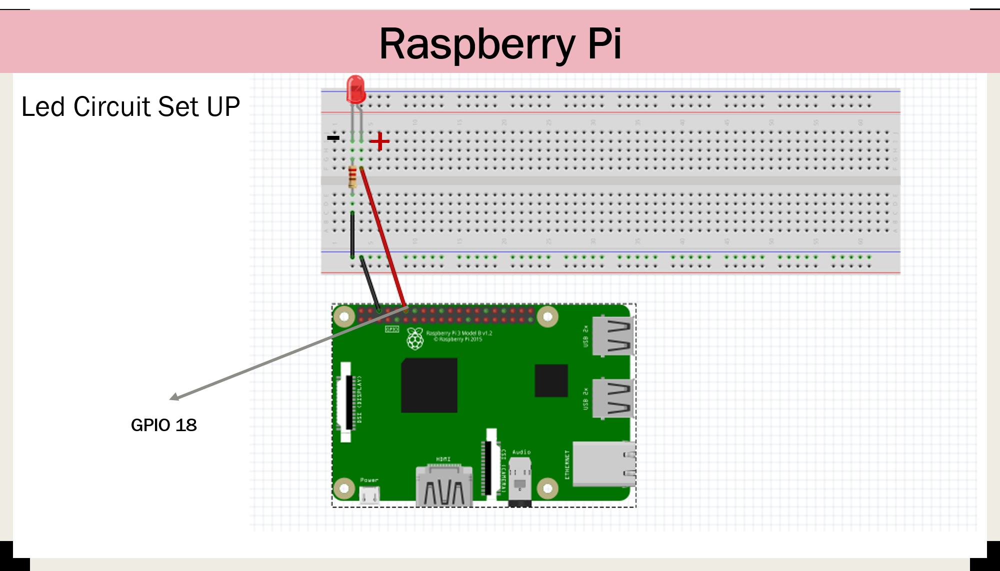

# coap




## Set up instructions of Coap
```
apt update && apt upgrade -y  
apt install python3-pip  
pip3 install CoAPthon3  
```

## Use Instructions
**1. Post.py**: can be used to post requests to the local server
`python3 post.py 'hello'`

**2. coap_post.py**: can be used to post requests to any coap server
`python3 coap_post.py`

**3. coap_server.py**: used to startup the local server listenining to a resource. Default listening resource is 'big'
`python3 coap_server.py`

**4. response.py**: this issues a get request to the local server to obtain any post sent to it
`python3 response.py`

**5. light_response.py**: this should run on the raspberry pi. it send instructions to turn the led light on or off when a post request is issued.
`python3 light_response.py`
